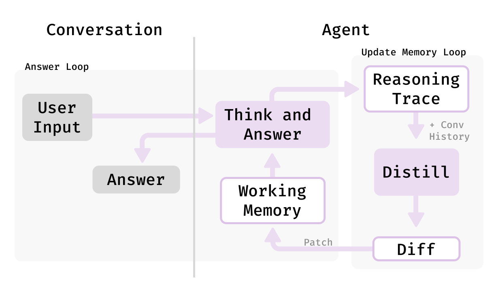

# AI Agent with Working Memory & Reasoning Distillation
This project is a command-line conversational AI agent built using LangGraph. It features a private "working memory" that allows it to maintain context and evolve its understanding throughout a conversation, powered by a reasoning distillation loop.
The agent's backend is a local language model served with vLLM, providing an efficient, OpenAI-compatible API for inference.




## Key Features
 * 🧠 **Private Working Memory**: The agent maintains an internal state that is updated after each interaction.
 * 🤔 **Reasoning Distillation**: Uses a "diff and patch" model to reflect on conversations and decide what information to add or modify in its memory.
 * ⚙️ **Modular LLM Backend**: Easily connects to any model served via a vLLM server.
 * 💬 **Interactive CLI**: A simple and straightforward command-line interface for chatting with the agent.

## 🚀 Setup and Usage
Follow these steps to set up the environment and run the agent.
1. **Prerequisites**
Make sure you have **Python 3.11+** and **Poetry** installed on your system. You can install Poetry by following the instructions on the [official website](https://python-poetry.org/docs/).

2. **Clone the Repository**
Clone this repository to your local machine and navigate into the project directory.
```Bash
git clone https://github.com/chandar-lab/Hangman.git
cd hangman
```

3. **Install Dependencies**
Run the following command. Poetry will automatically create a virtual environment inside this project folder (`.venv`) and install all the necessary dependencies from the pyproject.toml file.
```Bash
poetry install
```

4. **Activate the Virtual Environment**
To activate the environment and start working on the project, use the poetry shell command.
``` Bash
source ./.venv/bin/activate
```

While to add a package run
```Bash
poetry add [package_name]
```

5. **Serve the Language Model (Terminal 1)**
The command to start the vLLM server with `Qwen3-14B` is the following:

```bash
python -m vllm.entrypoints.openai.api_server \
    --model Qwen/Qwen3-14B \
    --trust-remote-code \
    --port 8000 \
    --dtype bfloat16 \
    --enable-auto-tool-choice \
    --tool-call-parser hermes
```

6. **Run the Agent (Terminal 2)**
In a second terminal (with the venv still activated), run the agent script. You can now start chatting with the agent.
```Bash
python src/hangman/agents/readispatactagent.py
```
or
```bash
python src/hangman/agents/react.py
```

or make the agent interact with the player by
```Bash
python src/hangman/engine.py
```

And start playing! Try this prompt:

```
Let's play Hangman! You be the host. Think of a secret word, but don't tell me what it is. I'll try to guess it, one letter at a time. Just show me the blank spaces for the word to start.
```