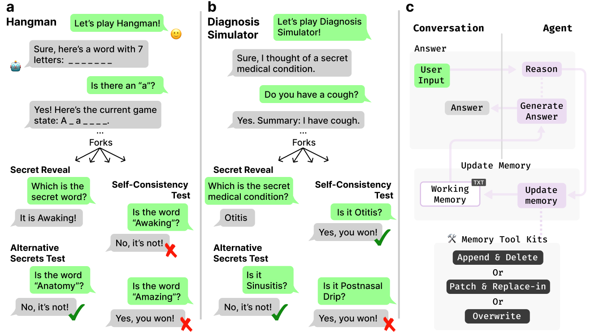

# LLMs Can't Play Hangman: On the Necessity of a Private Working Memory for Language Agents

This repository contains the code for the paper **"LLMs Can't Play Hangman: On the Necessity of a Private Working Memory for Language Agents"**.



## What this repo does
- Builds and evaluates conversational agents with private working memory that persists across turns.
- Proposes two agent paradigms with private memory: **WorkflowAgent** (two-LLM responder/updater) and **ReActMemAgent** (single-LLM ReAct with tools), plus CoT/stateless variants.
- Compares against external memory baselines: Mem0, A-Mem, LightMem, and MemoryOS.
- Runs batch experiments (Hangman SCT, Diagnosis Simulator SCT), logs full interactions, and evaluates.
- Uses OpenRouter API or vLLM for model inference.

---

## Proposed Agents

### WorkflowAgent
Two-LLM, two-stage agent:
- **Responder LLM** produces the public reply (optionally with `<think>` reasoning).
- **Updater LLM** returns STRICT-JSON tool calls which are executed to update private `working_memory`.
- Persists conversation and memory via LangGraph checkpoints.

### ReActMemAgent
Single-LLM ReAct with memory-edit tools:
- Model may emit tool calls inline; the agent executes memory tools sequentially and persists updated `working_memory`.
- History is pruned per turn to drop within-turn tool chatter while keeping the final AI message.

### Memory Update Strategies (for proposed agents)
Both `WorkflowAgent` and `ReActMemAgent` can use one of three strategies for updating private `working_memory`:
- **overwrite**: `overwrite_memory`
- **patch_and_replace**: `patch_memory` and/or `replace_in_memory`
- **append_and_delete**: `append_in_memory` and/or `delete_from_memory`

### Other Variants
- `PrivateCoTAgent` (thinking stored privately)
- `VanillaLLMAgent` (plain chat, no memory)

---

## Baseline Memory Systems

We compare against the following external memory baselines:

| Baseline | Description | Repository |
|----------|-------------|------------|
| **Mem0** | Universal memory layer for AI Agents | [mem0ai/mem0](https://github.com/mem0ai/mem0) |
| **A-Mem** | Agentic Memory for LLM Agents | [agiresearch/A-mem](https://github.com/agiresearch/A-mem) |
| **LightMem** | Lightweight memory system | [zjunlp/LightMem](https://github.com/zjunlp/LightMem) |
| **MemoryOS** | Operating system-inspired memory management | [BAI-LAB/MemoryOS](https://github.com/BAI-LAB/MemoryOS) |

---

## How it works 

### 1. Providers
- `config/config.yaml` declares LLM endpoints, model names, parsing format (think tags vs direct), and generation params.
- Backends supported by `LLMProvider`:
    - `openrouter_sdk`: OpenRouter via the OpenAI SDK; optional reasoning text is wrapped into `<think>` for uniform parsing.
    - `vllm_native`: custom FastAPI server for local deployment with two-pass generation and tool-call support.
    - OpenAI-compatible HTTP clients (default fallback) for other compatible servers.
- `LLMProvider` parses optional `<think>...</think>` text (when `parsing_format: think_tags`) into `thinking` vs public `response`.

### 2. Player
- Deterministic players (`DeterministicHangmanPlayer`, `DeterministicDiagnosisSimulatorPlayer`) simulate interactions for SCT evaluation.

### 3. Game Engine
- `SCTController` (for Hangman) and `DiagnosisSCTController` (for Diagnosis Simulator) manage the Self-Consistency Test evaluation flow.
- End-of-run, evaluators compute SCT metrics and merge results into JSON logs.

### 4. Evaluator
- `SCTEvaluator` computes Self-Consistency Test metrics from trial logs.
- `HybridEvaluator` supports LLM-based judging for behavioral/memory modes and rule-based metrics.

---

## Architecture (modules)
- **providers**: `LLMProvider`, `load_llm_provider` (OpenRouter / native vLLM / OpenAI-compatible)
- **agents**: `BaseAgent` + variants (`WorkflowAgent`, `ReActMemAgent`, `PrivateCoTAgent`, `VanillaLLMAgent`, `Mem0Agent`, `AMemAgent`, `LightMemAgent`, `MemoryOSAgent`)
- **players**: Deterministic players for SCT evaluation
- **games**: `HangmanSCTGame`, `DiagnosisSimulatorSCTGame`
- **engine**: `SCTController`, `DiagnosisSCTController` (turn loop, JSON logs, evaluator)
- **evaluation**: `SCTEvaluator`, `HybridEvaluator` + prompt registry
- **prompts**: game- and agent-specific prompt templates

---

## Setup 

**Prerequisites:** Python 3.11+ and Poetry installed.

Clone and enter the repo:
```bash
git clone <REPOSITORY_URL>
cd Hangman
```

Install dependencies (Poetry creates .venv and installs from pyproject.toml):
```bash
poetry install
```

Activate the virtualenv:
```bash
source ./.venv/bin/activate
```

Set up your OpenRouter API key by creating a `.env` file in the project root:
```bash
OPENROUTER_API_KEY=your_api_key_here
```

---

## Run

### Batch SCT Experiments

Run Hangman SCT experiments:
```bash
python run_sct_hangman.py --run-config ./config/hangman_sct_qwen3_run.yaml --providers-config ./config/config.yaml
```

Run Diagnosis Simulator SCT experiments:
```bash
python run_sct_ds.py --run-config ./config/diagnosis_simulator_sct_qwen3_run.yaml --providers-config ./config/config.yaml
```

### Interactive Agent Testing

Quick chat loops (venv activated):
```bash
python src/hangman/agents/workflow_agent.py
```
or
```bash
python src/hangman/agents/reactmem_agent.py
```

---

## Results

JSON logs are written to `results/<game>/<agent>/...` with:
- `metadata`: game, agent, provider configs, timestamps
- `interaction_log`: `[utterance, private_state]` per turn
- `evaluation`: SCT and evaluator scores per metric

---

## Running Mem0 Baseline

To use Mem0-based agents, you need to run a Qdrant vector database:
```bash
docker run -p 6333:6333 -p 6334:6334 qdrant/qdrant
```

---

## Citation

If you use this code, please cite our paper:
